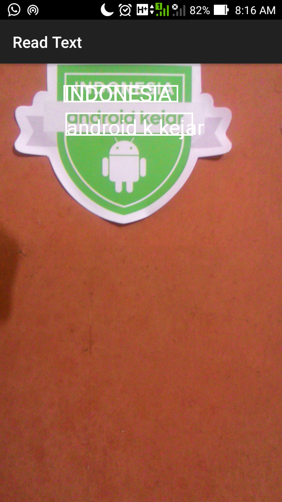

# ocr-reader
# Optical Character Recognition
an Android app for recognizing character using android Mobile Vision API


## Features
```
1. Recognizing text 
```
```
2. make the text to get sound while it has been recognized
```


